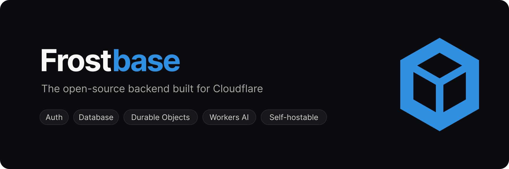

<p align="center">
  
</p>

<p align="center">
  <a href="https://frostbase.dev"><strong>Hosted</strong></a> ·
  <a href="https://frostbase.dev/dashboard">Live demo</a> ·
  <a href="#self-host">Self-host</a> ·
  <a href="CONTRIBUTING.md">Contributing</a>
</p>

<p align="center">
  <a href="LICENSE"></a>
  <a href="../../actions/workflows/quality.yaml"></a>
  <a href="../../actions/workflows/e2e.yaml"></a>
</p>

The open-source Firebase alternative on Cloudflare. Every project gets its own
Durable Objects, so one tenant's data is physically separate from the next —
isolation by architecture, not by a `WHERE` clause.

- **Auth** — Better Auth per project: email/password, social sign-in, roles
  and permissions, project-signed JWTs.
- **Database** — JSON collections (no schema) and typed SQL tables, live
  queries on both, regional read replicas, export/import, 30-day rollback.
- **Remote Config** — feature flags and tuning values your app reads at
  startup, targeted by country, role, version, or rollout percentage —
  flipped without shipping a release.
- **Storage** — buckets of files on R2: public/auth/owner access modes,
  signed URLs, multipart uploads, a file browser in the console.

Use it hosted at [frostbase.dev](https://frostbase.dev), or run the
whole stack on your own Cloudflare account. Same code either way.

## Hosted

Sign up, create a project, point your app at its id:

```ts
const baseUrl = 'https://frostbase.dev/api/projects/<project-id>';
// auth -> `${baseUrl}/auth`   db -> `${baseUrl}/db`
```

Add your app's origin under the project's **Settings** — that list is the CSRF
allowlist, and an unlisted origin gets a 403.

For a server credential, from the CLI:

```bash
npm install -g @frostbase-dev/cli
frostbase login
frostbase init                              # links this directory to a project
frostbase key create server --env-file      # writes a service key to .env.local
```

Limits: 5 projects per org, 5 branches per project.

## Self-host

```bash
git clone https://github.com/frostbase-dev/frostbase.git
cd frostbase && npm install
npm run dev          # localhost:5173/dashboard — no secrets, demo mode on
```

Deploy the whole stack to your account:

```bash
npx wrangler login
npm run deploy:all                             # one Worker per agent + the dashboard
npx wrangler secret put CONSOLE_SETUP_TOKEN    # 24+ chars — then claim the console at /login
```

The setup token proves you control the deployment — without it, a fresh
install would belong to whoever loads `/login` first. It also reclaims a
console you do not own.

Everything else is optional and degrades cleanly when absent:

- **Storage** needs R2 — create a bucket and add the `BUCKET` binding
  described in `agents/storage/wrangler.jsonc`.
- **Auth-event charts** need Analytics Engine, a free dashboard toggle; then
  add the two lines shown in `agents/auth/wrangler.jsonc`.
- Google/GitHub sign-in, email, and Sentry are opt-in secrets.

Prefer buttons? One per Worker, same order as `deploy:all`:
[auth](https://deploy.workers.cloudflare.com/?url=https://github.com/frostbase-dev/frostbase/tree/main/agents/auth) ·
[db](https://deploy.workers.cloudflare.com/?url=https://github.com/frostbase-dev/frostbase/tree/main/agents/db) ·
[storage](https://deploy.workers.cloudflare.com/?url=https://github.com/frostbase-dev/frostbase/tree/main/agents/storage) ·
[dashboard](https://deploy.workers.cloudflare.com/?url=https://github.com/frostbase-dev/frostbase)

## Add the agents to a Worker you already have

The console is optional — each agent is a normal npm package:

```bash
frostbase init my-backend   # scaffolds a Worker with auth
cd my-backend
frostbase add db            # documents + SQL tables, live queries on both
frostbase add storage       # buckets of files on R2
frostbase deploy
```

`add` merges the agent's wrangler config into yours without overwriting
anything you set, exports its Durable Object classes from your entrypoint, and
adds a type assertion so a missing binding fails at compile time.

## Use it from your app

### Auth

Better Auth, per project — so its client works unmodified:

```ts
const authClient = createAuthClient({ baseURL: `${baseUrl}/auth` });
await authClient.signUp.email({ name, email, password });
```

Browsers get a cookie; everything else uses the `set-auth-token` bearer. That
signed-in user's token is what the other agents verify — no ambient API key.

### Database

**Documents** need no schema; a collection exists the moment you write to it:

```ts
const db = createDbClient({ baseUrl: `${baseUrl}/db`, getToken });

const posts = db.collection('posts');
await posts.create({ title: 'Hello', votes: 1 });
await posts.query({ orderBy: [{ field: 'votes', direction: 'desc' }], limit: 25 });
```

**Tables** are schema-first: declare typed columns once, then query them with
real SQL through drizzle (`frostbase schema generate` emits the schema):

```ts
const sql = drizzleTable({ baseUrl: `${baseUrl}/db`, table: 'todos', getToken });
await sql.select().from(todos).orderBy(desc(todos.created_at));
```

Each table is its own Durable Object — its own 10 GB, its own thread, its own
replicas — so SQL is single-table by design: filters, aggregates, subqueries,
and CTEs yes; DDL and cross-table joins no.

**Joins** happen in a view: declare 2–5 member tables and a read-only replica
follows their change logs into one SQLite, where a plain `SELECT` can join
them. Views are eventually consistent (~3s) — built for reporting reads,
not invariants.

**Realtime** is a `subscribe` on any collection or table query: a snapshot,
then added/modified/removed deltas as writes land, multiplexed over one
WebSocket per client:

```ts
posts.subscribe(
	{ orderBy: [{ field: 'votes', direction: 'desc' }], limit: 25 },
	{ onSnapshot: render, onChange: (change, docs) => render(docs) }
);
```

### Remote Config

The switch you reach for while production is on fire — flip it in the console
and every client obeys, no deploy:

```ts
const config = db.remoteConfig({ defaults: { signupsOpen: true } });
await config.fetch(); // never throws — offline keeps the defaults

if (!config.get('signupsOpen')) {
	form.replaceWith('Signups are paused — back soon.');
}
```

### Storage

Buckets of files with per-bucket access modes:

```ts
import { createStorageClient } from '@frostbase-dev/storage/client';

const storage = createStorageClient({
	baseUrl: 'https://frostbase.dev/agents/storage-agent/<project-id>',
	getToken
});

const files = storage.from('avatars');
await files.upload('me.png', file); // any size — large files go multipart automatically

// A URL a browser can hold — drops straight into 
const { signedUrl } = await files.createSignedUrl('me.png', { expiresIn: 3600 });
const { objects, folders } = await files.list({ prefix: '', folders: true });
```

### On a server

With no user to relay — a cron, queue consumer, or webhook — mint a
**service key** (`frostbase key create`, or the project's Settings
page). Each agent ships an `./admin` client over it:

```ts
import { createDbAdmin } from '@frostbase-dev/db/admin';
import { createAuthAdmin } from '@frostbase-dev/auth/admin';
import { createStorageAdmin } from '@frostbase-dev/storage/admin';

const db = createDbAdmin(); // url, project, and key from the environment
const post = await db.collection('posts').get(id);
await db.collection('posts').patch(id, { votes: post.data.votes + 1 });

// Seed or migrate accounts with no sign-up flow
await createAuthAdmin().createUser({ email, password, name });
```

Service keys are scoped to one project, bypass access modes like an operator,
and are refused on any request carrying an `Origin` header — a key pasted into
frontend code fails on the first request instead of shipping in a bundle. The
same routes work over raw HTTP; every project serves its OpenAPI document at
`/api/projects/<id>/openapi.json`.

## Checks

```bash
npm run check   # svelte-check
npm run lint    # prettier + eslint
npm test        # Playwright against real workerd
```

## Security

Report vulnerabilities privately via [SECURITY.md](SECURITY.md). Keep
`DEMO_MODE` unset anywhere real users live.

## License

[Apache-2.0](LICENSE). Frostbase is an independent project, not affiliated
with or endorsed by Cloudflare, Inc. See [NOTICE](NOTICE).
